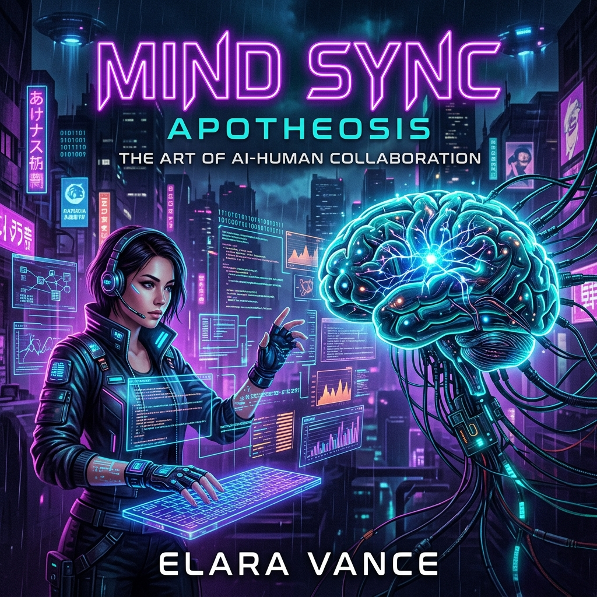
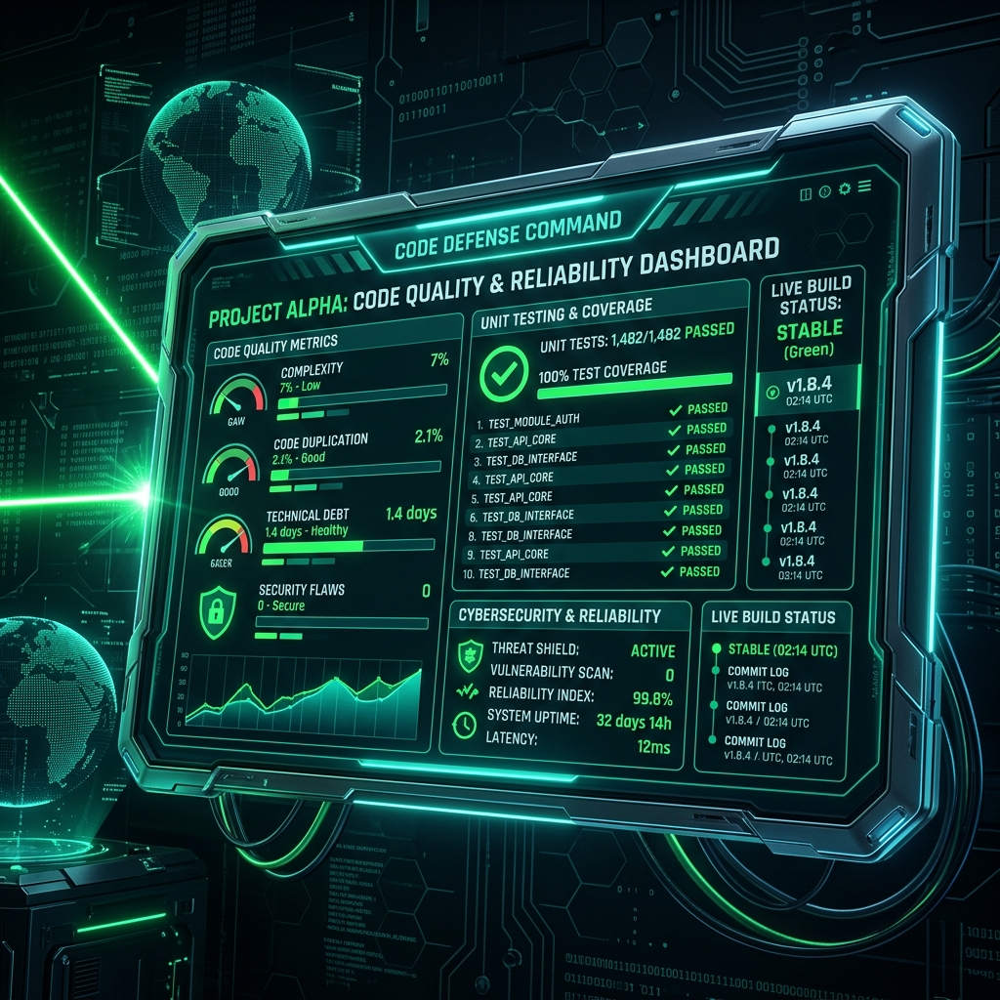

# O Futuro Híbrido: Como IAs Generativas Estão Redefinindo o Desenvolvimento Backend

## Prefácio: O Novo Paradigma do Desenvolvimento

O desenvolvimento de software sempre avançou através de camadas de abstração. Da programação em cartões perfurados ao Assembly, do Assembly para linguagens de alto nível estruturadas, e depois para frameworks modernos e computação em nuvem. Cada salto de abstração aumentou a produtividade humana, permitindo-nos focar mais nas regras de negócio e menos na sintaxe e infraestrutura mecânica.

Hoje, estamos diante do próximo grande salto: a **Inteligência Artificial Generativa**. Não se trata de substituir o desenvolvedor, mas de elevá-lo a um papel de arquitetura e curadoria. Este e-book explora como essa simbiose está redefinindo as engrenagens invisíveis do software — o backend.

---

## Capítulo 1: A Revolução Silenciosa no Design de APIs

A criação de APIs tradicionalmente envolve planejamento rigoroso de estruturas de dados, roteamento, códigos de status HTTP e documentação como OpenAPI/Swagger. Embora essencial, esse processo exige muito trabalho braçal e repetitivo.

Com o auxílio de Modelos de Linguagem de Grande Porte (LLMs), o design de APIs torna-se declarativo. O desenvolvedor backend descreve em linguagem natural o propósito do domínio de negócio (ex: "Necessito de uma API de comércio eletrônico com rotas para listagem, filtros de preço e tratamento de transações concorrentes"). A IA então propõe contratos OpenAPI estruturados, esquemas de validação JSON e rotas do FastAPI/Express limpas e otimizadas em segundos.

A inteligência da IA não reside em criar códigos arbitrários, mas na capacidade de consolidar boas práticas de design (RESTful, tratamento correto de cabeçalhos, paginação) de forma instantânea, permitindo ao engenheiro validar e refinar a arquitetura ao invés de digitar sintaxes triviais.

---

## Capítulo 2: Banco de Dados Inteligente e Assistido

No centro de qualquer sistema backend robusto reside o banco de dados. Seja SQL ou NoSQL, otimizar consultas complexas, estruturar indexação e desenhar relacionamentos performáticos são desafios clássicos.

A IA Generativa atua aqui como um DBA especialista disponível 24 horas por dia. O uso prático inclui:
* **Tradutores Natural-to-SQL:** Permitir que analistas de dados consultem bancos convertendo perguntas humanas em queries complexas com múltiplos `JOIN`s de forma segura.
* **Otimização de Consultas:** Ao passar um comando `EXPLAIN` de uma query lenta para uma IA, ela consegue diagnosticar gargalos, sugerir a criação de índices compostos apropriados ou propor a reescrita da consulta para evitar varreduras de tabela inteira (full table scans).
* **Migração de Schemas:** Facilitação na conversão de bancos relacionais para NoSQL, propondo estratégias de desnormalização ideais de acordo com os padrões de acesso descritos.

---

## Capítulo 3: TDD Aumentado com IAs Generativas

O **Desenvolvimento Orientado a Testes (TDD)** é o padrão ouro para construir sistemas confiáveis. No entanto, muitos desenvolvedores ignoram ou reduzem a cobertura de testes devido ao tempo necessário para criar mocks de bancos de dados, simular chamadas de rede e prever todos os fluxos de exceção.

IAs Generativas são aliadas perfeitas para a escrita de testes unitários e de integração. Ao fornecer a assinatura de uma função ou usecase, a IA consegue:
* Prever caminhos felizes (happy paths) e, mais importante, caminhos de exceção (edge cases) que o programador humano poderia esquecer.
* Gerar fábricas de dados de teste (factories) realistas de forma automática.
* Desenvolver scripts de monkeypatching e mocking robustos para drivers de banco de dados assíncronos e clientes HTTP (como fizemos com patches de compatibilidade de UUID e Decimal128 no pytest).

Com a IA escrevendo a mecânica dos testes, o desenvolvedor backend adota o TDD com muito mais facilidade e prazer, gerando softwares mais seguros e resilientes.

---

## Capítulo 4: Reflexão Prática: O Código "Natty" vs "Fake"

Inspirado no meme "Natty or Not" do fisiculturismo, no desenvolvimento de software hoje enfrentamos a mesma pergunta: o código é **"Natty"** (escrito puramente à mão por inteligência humana) ou **"Fake/Juiced"** (gerado com o auxílio de IA)?

A verdade é que o futuro pertence ao desenvolvimento híbrido. Um programador purista "natty" que rejeita o uso de IAs corre o risco de tornar-se obsoleto devido à velocidade de entrega menor. Por outro lado, um programador puramente "fake" que apenas copia e cola códigos gerados por IA sem entendê-los criará sistemas instáveis, inseguros e difíceis de depurar.

O backend de alta performance exige **curadoria humana**. A IA gera a matéria-prima sintética; o desenvolvedor inspeciona, valida, testa e assegura que a arquitetura respeita os limites de segurança, concorrência e manutenibilidade.

O software do futuro não é "natty" nem "fake", mas sim a sinergia perfeita entre a criatividade e o rigor humanos potencializados pela escala de conhecimento artificial.
